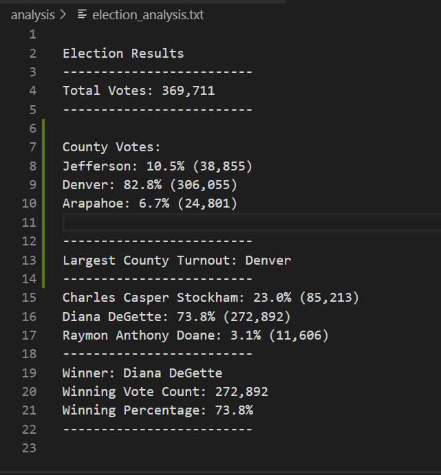

# Election_Analysis
Use of Python to evaluate election polling data

## Project Overview

A Colorado Board of Elections employee has given you the following tasks to complete the election audit of a recent local congressional election.

1. Calculate the total number of votes cast.
2. Get a complete list of candidates who received votes.
3. Calculate the total number of votes each candidate received.
4. Calculate the percentage of votes each candidate won.
5. Determine the winner of the election based on popular vote.

## Resources
- Data Source: elections_results.csv
- Software: Python 3.7.6 (64-bit), Visual Studio Code, 1.50.0

## Summary of Election Audit Results
The analysis of the election show that:
- There were 369,711 votes cast in the election.
- The candidates were:
    - Charles Casper Stockham
    - Diana DeGette
    - Raymon Anthony Doane
- The candidates results were:
    - Charles Casper Stockham received 23.0% of the vote and 85,213 number of votes.
    - Diana DeGette received 73.8% of the vote and 272,892 number of votes.
    - Raymon Anthony Doane received 3.1% of the vote and 11,606 number of votes.
- The winner of the election was: 
    - Diana DeGette, who received 73.8% of the vote and 272,892 number of votes.

The following image shows code with appropriate variables which produced the winning candidate along with the number of votes and the percentage of the votes won:

The following image shows code with appropriate variables which produced the winning candidate along with the number of votes and the percentage of the votes won:

**Provide a breakdown of the number of votes and the percentage of total votes for each county in the precinct.**
A breakdown of county votes is as follows:
Jefferson: 10.5% (38, 855)
Denver: 82.8% (306,055)
Arapahoe: 6.7% (24,801)

*Which county had the largest number of votes?*
The county with the largest number of votes is Denver 

## Challenge Summary

*In a summary statement, provide a business proposal to the election commission on how this script can be used—with some modifications—for any election. Give at least two examples of how this script can be modified to be used for other elections.

Two examples of how this script can be modified to be used for other elections are:
 - Refactor the code to Open and Read files using Python.
 - Add the appropriate Dependencies, Modules, and Packages to allow for the ability to access certain types of files. In this current script, **import csv** was used. 
 
 The following picture shows the final output of the code as displayed in a .txt file:
 
  
